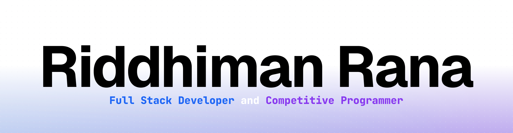

<picture>
  <source media="(prefers-color-scheme: dark)" srcset="./banners/riddhimanrana-dark.png">
  
</picture>

I'm a high school freshman with a strong passion for competitive programming and modern web development. I'm particularly interested in creating technology that solves real-world problems and aspire to become an entrepreneur in the future.

## What Do I Do?

#### Web Dev
- Next.js
- React.js
- Tailwind CSS
- Vercel
- Supabase

#### Competitive Programming
- C++
- Python
- Java

## Skills

#### General Skills

- Programming for 8 years
- Fluent in C++, Python, and Typescript, experience in Java, Rust, and more
- Competitive Programming and Contests for 2 years
- Web Development for 2 years

#### Web Development

- 2 years of web dev experience
- Worked with Next.js, React.js, Flask, Django, Supabase, Cloudflare, and Vercel for full stack development
- Use Tailwind CSS and shadcn/ui for styling

#### Competitive Programming

- 2 years of competitive programming experience
- Solved 100+ problems on LeetCode, USACO, Codeforces, and more
- Participated in BAPC, USACO, and Codeforces contests

## Projects
- [Let's Assist](https://lets-assist.com): Comprehensive online volunteering platform that helps organizations and high school CSF programs manage, track, and coordinate volunteering activities for students and communities.
- [PyEcoHome Energy Tracker](https://github.com/riddhimanrana/PyEcoHome-Energy-Tracker): A Python-based energy tracker that helps users monitor and analyze their energy consumption patterns, providing insights and recommendations for reducing energy usage and costs. Won finalist for Congressional App Challenge 2023.
- [Portfolio](https://rrcoder0167.is-a.dev): My personal portfolio website showcasing my projects, skills, and experience. Built with Next.js and Tailwind CSS.
- [USACO Solutions](https://github.com/riddhimanrana/usaco-solutions): A collection of my solutions to USACO problems and prep materials, organized by year and problem type.

## Setup

#### Hardware

- Main Computer: [M1 13" MacBook Air](https://support.apple.com/en-us/111883) (8GB RAM, 512GB SSD, 8 Core GPU)
- Mouse: [Razer Viper](https://mysupport.razer.com/app/answers/detail/a_id/3669/~/razer-viper-%7C-rz01-02550-support-%26-faqs) (Wired)
- Keyboard: [Keychron K8](https://www.keychron.com/products/keychron-k8-tenkeyless-wireless-mechanical-keyboard?variant=32018252955737) (Gateron G Pro Brown, Hot-swappable, RGB, Foam Modded)
- Headphones: [AirPods Pro 2](https://support.apple.com/en-us/111851) (USB-C)

## What's on my Computer?

- Browser: [Arc](https://arc.net/)
- Terminal: [Warp](https://warp.dev/)
- Code Editor: [VSCode](https://code.visualstudio.com/) and [Zed](https://zed.dev/)
- App Launcher: [Raycast](https://www.raycast.com/)

More info and hotkeys at [riddhimanrana/dotfiles](https://github.com/riddhimanrana/dotfiles)

## Stats

